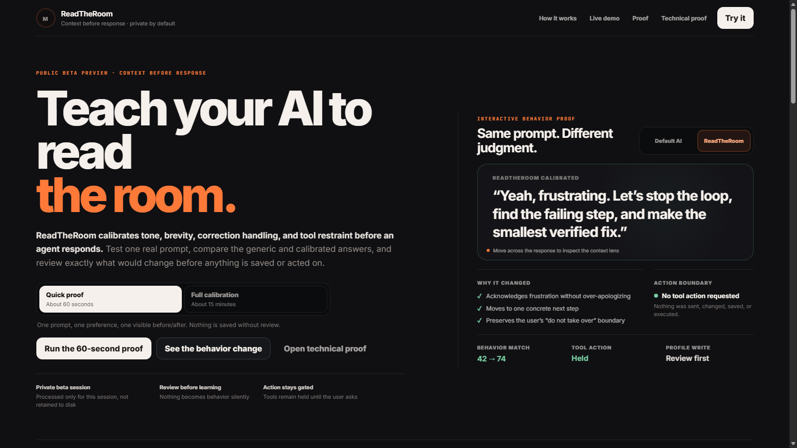

# ReadTheRoom

**Make your AI stop feeling generic.**

ReadTheRoom is a local, reviewable behavior-calibration layer for AI assistants.
A short guided session tunes how your assistant handles directness, warmth,
humor, profanity, corrections, brainstorming, short messages, and tool restraint
, without turning every conversation into a settings panel.

One guided session. Zero generic presets. Your AI actually *reads the room.*

> Public Professional v3.4 is a controlled public beta. Calibration state is ephemeral and local to the running process. It is not a hosted account service or a production SLA.



**Live demo:** [watch the 60-second proof in action](docs/images/rtr-demo.mp4). Start the proof, run a prompt, compare Default AI vs ReadTheRoom.

## What it does

- **Guided behavior calibration**, tune real behavior, not tone sliders
- **Explicit profile and context controls**, you decide what the AI knows and how it acts
- **Sandbox-style experimentation**, test freely, nothing learns silently
- **Reviewable calibration receipts**, see exactly what changed and why
- **Public-only runtime boundaries**, loopback by default, no silent data collection
- **Responsive desktop and mobile**, calibrate anywhere

## Quick start

Requirements: Node.js 22 or newer.

```bash
npm test
npm start
```

Open `http://127.0.0.1:8877/read-the-room-public-pro-v3-4/`.

No dependency installation is required. The package uses Node's built-in runtime and test runner.

## Why it exists

Most "AI personality" settings are a slider and a prayer. ReadTheRoom treats
behavior calibration as a first-class problem: a guided session that produces a
reviewable, repeatable behavior profile, so your assistant stops sounding like
a default and starts sounding like *yours*.

## Public API surface

The standalone server exposes only the public calibration application and its documented profile, artifact, archetype, apply, session, and health routes. Internal MAYA runtime files and private profiles are not included.

## Verification

```bash
node --check scripts/read-the-room/readtheroomPublicServer.mjs
node --check scripts/read-the-room/readtheroomPolicy.js
node --check scripts/read-the-room/readtheroomCalibrationSession.js
npm test
```

A ready-to-enable GitHub Actions template is included at `docs/ci/verify.yml.example`; local verification remains the release authority for this beta.

The release has also passed clean-extraction, browser, responsive-layout, session-isolation, malformed-request, and public-boundary audits. See [PUBLIC_BETA_LIMITS.md](PUBLIC_BETA_LIMITS.md) for the precise claim boundary.

## Security and privacy

- Loopback-only server by default
- Ephemeral in-memory calibration sessions
- No account system or telemetry
- Hardened browser response headers
- Explicit route allowlist and traversal denial

Do not expose the development server directly to the internet. Report sensitive findings privately using [SECURITY.md](SECURITY.md).

## License

ReadTheRoom Public Professional is distributed under the 2ndNatureAi Public Beta Evaluation License 1.0. See [LICENSE.txt](LICENSE.txt) for the full terms.

Bundled font files remain governed by their own notices: [OFL-Inter.txt](read-the-room-public-pro/assets/fonts/OFL-Inter.txt) and [OFL-JetBrains-Mono.txt](read-the-room-public-pro/assets/fonts/OFL-JetBrains-Mono.txt).

Copyright (c) 2026 2ndNatureAi.
